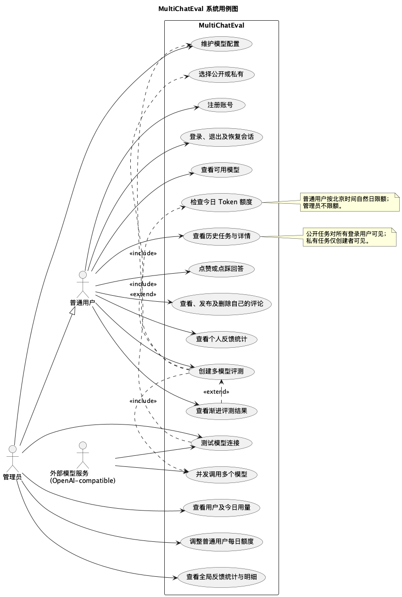
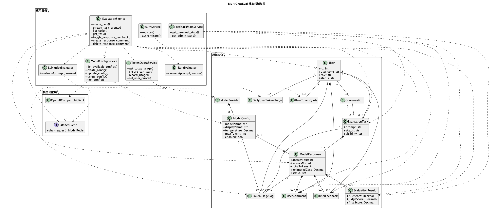
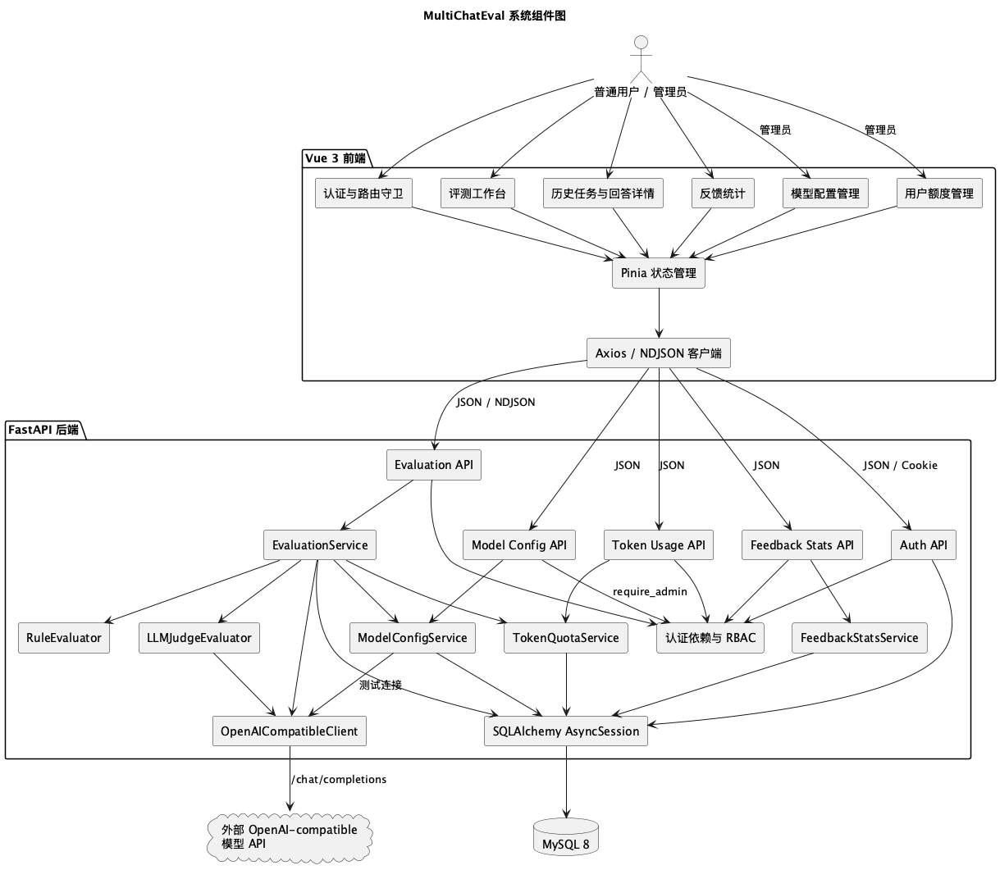
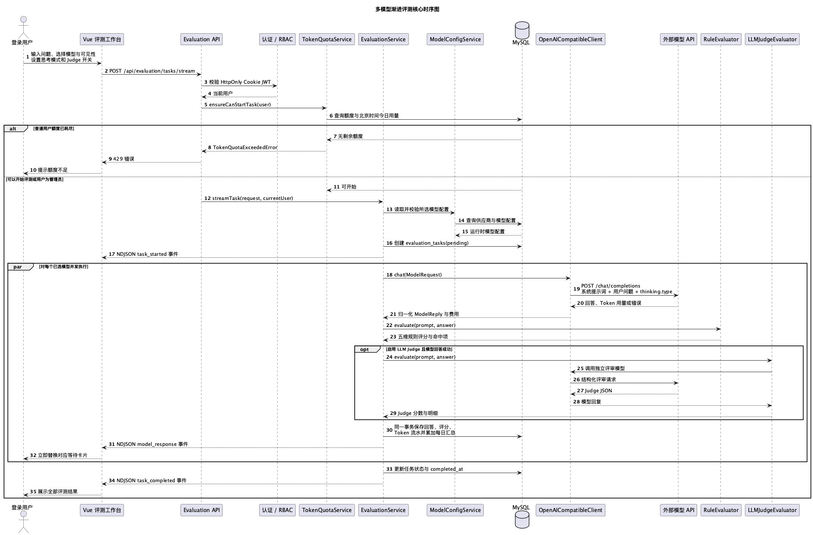
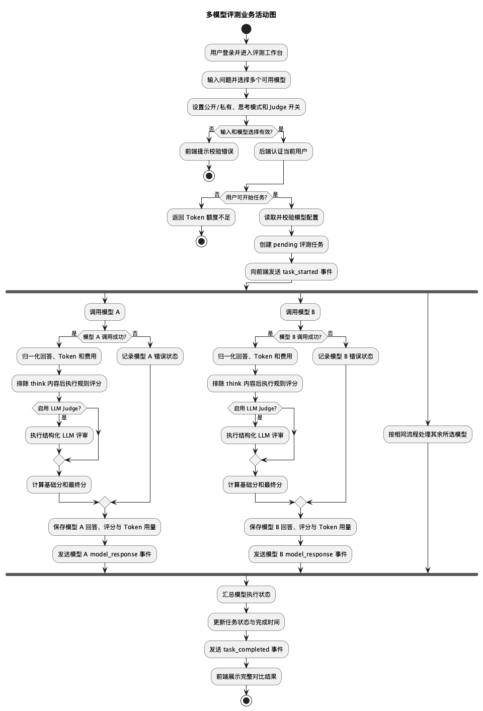
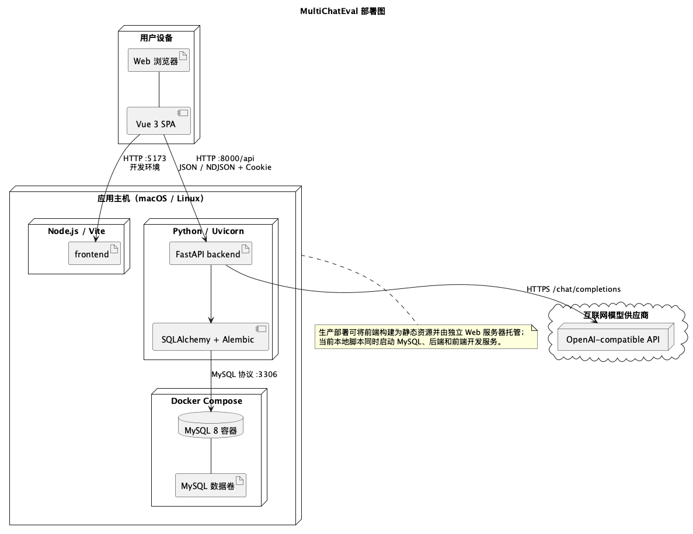

# MultiChatEval UML 与 ER 建模图

本文档依据当前前端路由、FastAPI 接口、服务层、SQLAlchemy 模型及数据库设计整理，仅描述系统已经实现的能力。模型推荐、语言一致性评分、评论审核和结果导出等待办功能不纳入图示。

UML 图使用 PlantUML 编写，ER 图使用 Graphviz DOT 绘制。建议依次阅读用例图、组件图、时序图、活动图、领域类图、部署图和 ER 图。

## 1. 系统用例图

管理员继承普通用户能力，并额外拥有模型配置、用户额度管理和全局反馈统计权限。外部模型服务不属于系统内部，因此作为次要参与者表示。

## 2. 核心领域类图

领域类图分为实体、应用服务和模型适配层。`EvaluationService` 是评测主流程的编排中心；`ModelClient` 隔离具体模型协议，当前由 `OpenAICompatibleClient` 实现。完整数据库字段以 ER 图为准。

## 3. 系统组件图

前端通过统一 API 客户端访问后端。流式接口使用 NDJSON 返回逐 token 增量、回答完成和最终评分结果事件。后端通过认证依赖和 `require_admin` 实施访问控制，并通过异步 SQLAlchemy 会话访问 MySQL。

## 4. 多模型渐进评测时序图

接口先认证并检查额度，再创建任务。多个模型并发执行，每个模型完成后独立完成规则评分、可选 LLM Judge、费用计算和持久化，并立即向前端发送结果。单个模型失败不会阻塞其他模型。

## 5. 评测业务活动图

活动图用 A、B 和“其余模型”表达任意数量模型的并发处理。系统在每个模型分支内独立处理成功或失败，所有分支结束后再更新任务最终状态。

## 6. 系统部署图

部署图以仓库当前本地运行方式为主：Vue 开发服务、FastAPI/Uvicorn 和 Docker MySQL 位于应用主机，浏览器通过 HTTP 访问，后端通过 HTTPS 调用外部模型。生产环境可替换前端托管方式，但不改变系统逻辑边界。

## 7. 数据库 ER 图（Chen 表示法）

下图采用规范的 Chen 表示法：矩形表示实体，菱形表示联系，椭圆表示属性，下划线属性表示主键，连线旁标注实体参与联系的基数。为保证图形可读性，仅展示主键和关键业务属性；完整字段定义见下一节的数据库关系模式图。图形由 Graphviz 生成，源文件可随数据库结构继续维护。

ER 图完整覆盖当前 12 个持久化实体。`评测结果` 与 `模型回答` 在业务和 ORM 中按一对一使用，但数据库没有对 `evaluation_results.response_id` 设置唯一约束，因此图中依照数据库真实约束标为“一个回答可关联 0..N 个评测结果”。

## 9. 建模约束与维护说明

1. 本文档描述当前实现，不将路线图能力提前画入系统边界。
2. API、服务职责、数据表或持久化链路变化时，应同步更新对应 UML 图。
3. 表字段、外键或唯一约束变化时，应同时更新 `docs/database.md` 和本文 ER 图。
4. 主评测链路变化时，应同时更新 `docs/architecture.md`、时序图、活动图和组件图。
5. 领域类图使用驼峰名称提高可读性；ER 图保留数据库实际蛇形命名。
